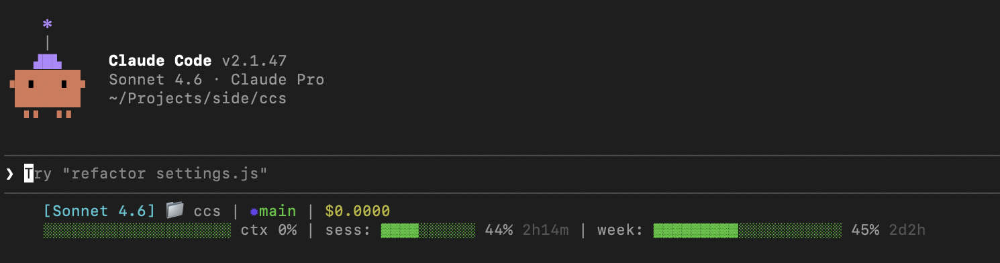

# Claude Code Statusline

[](https://github.com/yusufalikync/ccs/actions/workflows/ci.yml)
[](https://www.npmjs.com/package/claude-code-statusline)
[](./LICENSE)

**C**laude **C**ode **S**tatusline (ccs): Real-time usage stats in Claude Code's status line — see your session limit, weekly limit, remaining time, context usage, and cost at a glance.

```text
[Opus 4.6] 📁 my-project | ✹main | $0.3595
▓▓▓▓░░░░░░░░░░░░░░░░ ctx 20% | sess: ▓▓▓▓▓▓▓▓░░ 75% 3h19m | week: ▓▓▓▓▓▓▓░░░░░░░░░░░░░ 34% 3d20h
```

Progress bars are color-coded: green (<70%), yellow (70-89%), red (>=90%).



## Quick Start

```bash
npx claude-code-statusline install
```

That's it. Restart Claude Code and the status line appears.

## Requirements

| Requirement | Details |
|-------------|---------|
| **OS** | macOS, Linux, Windows |
| **Claude Code** | Logged in via OAuth — Pro or Max plan |
| **Node.js** | >= 18 |

> Zero external dependencies — uses only Node.js built-ins.

## Installation

### Option 1: npx (no global install)

```bash
npx claude-code-statusline install
```

### Option 2: Global install

```bash
npm install -g claude-code-statusline
ccs install
```

### What happens during install

1. Checks Node.js version (>= 18 required)
2. Copies `statusline.js` to `~/.claude/statusline.js`
3. Adds `statusLine` config to `~/.claude/settings.json` (creates a backup first)
4. Cleans up old `statusline.sh` if present (from previous versions)

> Existing settings are preserved — only the `statusLine` key is added. Running install multiple times is safe (idempotent).

## Usage

```bash
ccs install      # Install script & configure settings
ccs uninstall    # Remove script & clean up settings
ccs status       # Check if statusline is active
```

`ccs` and `claude-code-statusline` are interchangeable.

## What It Shows

**Line 1 — Session info:**

| Segment | Description |
|---------|-------------|
| `[Opus 4.6]` | Active model (cyan) |
| `📁 my-project` | Current workspace folder |
| `✹main` | Current git branch (green) — `✹` (purple) appears when there are uncommitted changes; hidden outside git repos |
| `$0.3595` | Current session cost (yellow) |

**Line 2 — Usage bars:**

| Segment | Description |
|---------|-------------|
| `▓▓▓▓░░░░ ctx 20%` | Context window usage with color-coded progress bar |
| `sess: 75% 3h19m` | 5-hour rolling window utilization + time until reset |
| `week: 34% 3d20h` | 7-day rolling window utilization + time until reset |

Progress bars are color-coded: green (<70%), yellow (70-89%), red (>=90%). If usage data is unavailable, line 2 shows only the context bar.

## How It Works

```text
Claude Code response
  → triggers statusline.js via stdin
    → parses model, cost, context from JSON input
    → reads OAuth token from platform credential store
    → fetches usage from api.anthropic.com/api/oauth/usage (cached 60s)
    → outputs formatted status line with progress bars
```

The script caches API responses at `<tmpdir>/claude_usage_cache_<session_id>.json` (60-second TTL, isolated per session) to avoid hitting the API on every response.

### Credential Access

OAuth token is read in priority order:

1. `CLAUDE_CODE_OAUTH_TOKEN` environment variable
2. `~/.claude/.credentials.json` file (primary on Linux/Windows)
3. macOS Keychain via `security` command (fallback — macOS removes the credentials file after login)

### API Details

- **Endpoint:** `GET https://api.anthropic.com/api/oauth/usage`
- **Auth:** OAuth token from platform credential store
- **Required header:** `anthropic-beta: oauth-2025-04-20`

## Uninstalling

```bash
ccs uninstall
```

This removes `~/.claude/statusline.js` and deletes the `statusLine` key from `~/.claude/settings.json` (with backup). No other settings are modified.

## Limitations

- **OAuth login only** — API key authentication does not have access to the usage endpoint.
- **Beta header may change** — `anthropic-beta: oauth-2025-04-20` could be updated by Anthropic in the future. If the status line stops showing usage data, check for an updated version of this package.

## Troubleshooting

| Problem | Solution |
|---------|----------|
| Usage data not showing | Make sure you're logged in via OAuth (`claude` command), not API key |
| Stale data | Delete `<tmpdir>/claude_usage_cache_*.json` to force a fresh API call |
| Status line not appearing | Run `ccs status` to check, then restart Claude Code |

## Contributing

```bash
git clone https://github.com/yusufalikync/ccs.git
cd ccs
npm test              # Run smoke tests
node bin/cli.js install   # Test install locally
```

See [CLAUDE.md](./CLAUDE.md) for architecture details and coding conventions.

## Author

**Yusuf Ali Koyuncu** — [GitHub](https://github.com/yusufalikync)

## License

[MIT](./LICENSE)
